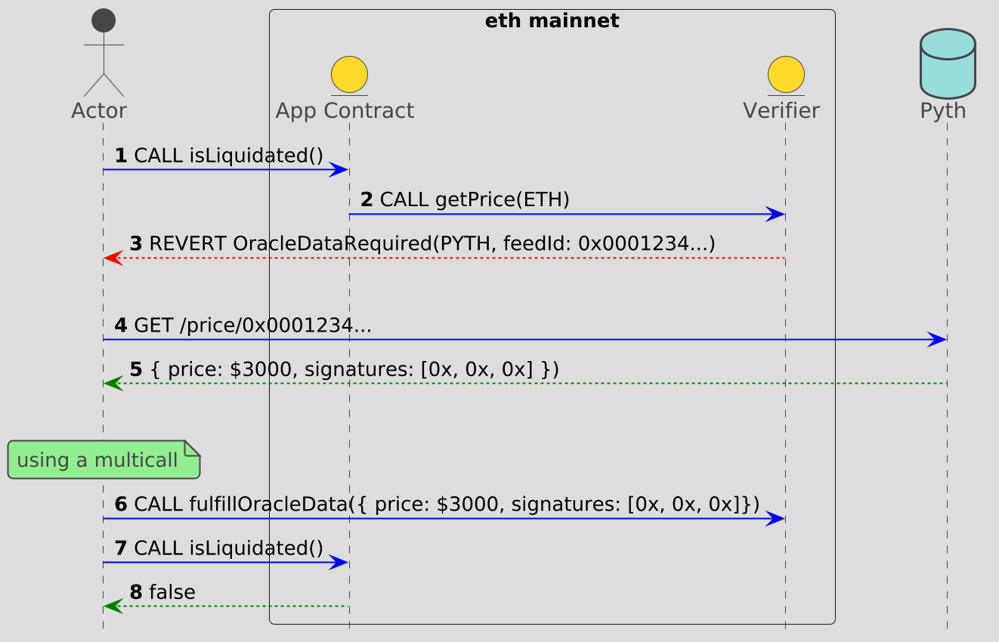

# ERC-7412



ERC-7412 is the implementation of an Ethereum Improvement Proposal to provide a mechanism for loading data from a trusted provider on-chain, on-demand. Its a successor to the more constrained EIP-3668.

This repository contains a basic [reference implementation for a client library](./src/index.ts) enabling [ERC-7412](https://eips.ethereum.org/EIPS/eip-7412) support and a [test](./test/client.mjs) demonstrating its functionality.

Currently, there are 3 off-chain data providers officially supported. They are automatically loaded and processed by the library if observed:

- Pyth
- Chainlink
- Redstone

To learn more about using ERC-7412, see the [integration guide](./docs/integrate.md).

## Development Information

The library uses `pnpm`. The usual node.js project commands apply:

```
pnpm install
pnpm build
pnpm test
```

### Run the integration Test

A series of test scripts are included in the repository. For example, to run the Pyth test:

```
RPC_URL=... pnpm test:e2e:pyth
```

Other oracle provider may require credentials from the provider or other environment variables, depending on the provider.
